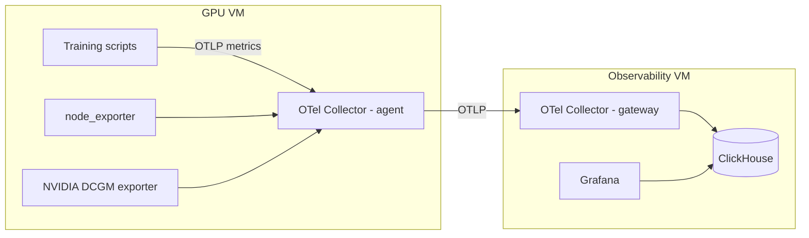

# Observability Stack

This stack provides a separate Observability VM that collects metrics from your GPU VM,
stores them in ClickHouse, and visualizes them in Grafana. The GPU VM stays clean —
only lightweight exporters and an OTel agent run there. The heavy lifting (storage,
dashboards) happens on the Obs VM.

## Components

- **`terraform/`** - Infrastructure provisioning (Yandex Cloud VMs, networking)
- **`ansible/`** - Configuration management and service deployment 
- **`dashboards/`** - Grafana dashboard definitions (JSON format)



## Why Terraform + Ansible

- **Terraform:** declarative infrastructure provisioning (VMs, networks, security groups) in Yandex Cloud
- **Ansible:** post-provisioning configuration management (installing Docker, deploying Compose stack, provisioning Grafana/ClickHouse)
- This split makes the system reproducible, auditable, and flexible (infrastructure vs software lifecycle separation)

### Cloud portability

Although the current Terraform configuration targets **Yandex Cloud** by default, the stack is designed
to be provider-agnostic. You can adapt it to AWS, GCP, or other cloud providers by changing the Terraform provider
and adjusting VM provisioning settings as needed. The Ansible roles and Docker Compose setup are cloud-neutral and
will work on any Linux VM, regardless of the cloud environment.

## Installing Yandex Cloud CLI on macOS

```shell
curl -sSL https://storage.yandexcloud.net/yandexcloud-yc/install.sh | bash
exec -l $SHELL

yc version
yc init # or yc init --federation-id=<your_federation_id>
```

Check out the official [Yandex Cloud documentation](https://yandex.cloud/en/docs/cli/quickstart#initialize) for more details.

### Installing Terraform on macOS

```bash
cd ~/Downloads
curl -LO https://releases.hashicorp.com/terraform/1.13.3/terraform_1.13.3_darwin_arm64.zip

ls -lh terraform_1.13.3_darwin_arm64.zip
unzip terraform_1.13.3_darwin_arm64.zip

mkdir -p ~/bin
mv terraform ~/bin/
echo 'export PATH="$HOME/bin:$PATH"' >> ~/.zshrc
exec -l $SHELL

terraform -v
```

## Running Terraform commands

```shell
cd terraform
cp terraform.tfvars.example terraform.tfvars
```

Edit terraform.tfvars with your values:

```shell
terraform init
terraform apply
```

When prompted, type `yes` to confirm. Terraform will provision the Observability VM and print
the `obs_public_ip` in the output. You’ll need this IP for the Ansible step.

Keep the `terraform.tfstate` file safe if you plan to manage the stack over time (e.g., in remote storage for teams).

## Installing Ansible on macOS

```shell
brew install ansible
ansible --version
```

## Ansible

A suggested `.gitignore` template for Ansible is included in this repo.
Some sensitive paths are commented out so you can push the template itself to Git.
Later, uncomment them to ensure secrets and local files are excluded.

From your workstation (with SSH access to the VM’s public IP):

```shell
cd ansible

# (first run only) install needed collection
ansible-galaxy collection install community.docker

# set env secrets for group_vars (or edit obs.yml directly)
# You can either export these secrets as environment variables (shown below)
# or place them directly in group_vars/obs.yml for convenience.
export CH_USER=otel
export CH_PASSWORD='CHANGE_ME_STRONG'
export CH_DB=otel_metrics
export GRAFANA_ADMIN_USER=admin
export GRAFANA_ADMIN_PASSWORD='CHANGE_ME_STRONG'

# check connectivity
ansible -i inventory.ini obs -m ping

# run provisioning
ansible-playbook -i inventory.ini playbooks/site.yml
```

### Verifying the deployment

After successful deployment, verify that all services are running:

```shell
# Check ClickHouse health
curl -s http://<obs_public_ip>:8123/ping
# Should return: Ok.

# Check Grafana availability
curl -s -o /dev/null -w "%{http_code}" http://<obs_public_ip>:3000
# Should return: 302 (redirect to login page)

# Check OpenTelemetry Collector ports
nc -vz <obs_public_ip> 4317  # gRPC endpoint
nc -vz <obs_public_ip> 4318  # HTTP endpoint

# Check Docker containers status on the VM
ssh ubuntu@<obs_public_ip> "sudo docker ps"
# Should show 3 running containers: clickhouse, grafana, otel-gateway

# View container logs if needed
ssh ubuntu@<obs_public_ip> "sudo docker logs obs-clickhouse-1"
ssh ubuntu@<obs_public_ip> "sudo docker logs obs-grafana-1"
ssh ubuntu@<obs_public_ip> "sudo docker logs obs-otel-gateway-1"
```

## Tearing down the stack

To avoid unnecessary costs in Yandex Cloud, you can stop or delete the Observability VM when not in use.

### Option A: Stop the VM (keeps disks and IPs)

```bash
yc compute instance stop --name obs-vm
```

Start it again later with:

```bash
yc compute instance start --name obs-vm
```

Note: you will still incur charges for disks and reserved IPs.

### Option B: Destroy all resources via Terraform (recommended for saving costs)

From the terraform directory:

```bash
cd terraform
terraform destroy
```

This removes the VM, disks, public IP, and security group created for the observability stack.
You will be prompted to confirm with `yes`.

Keep the `terraform.tfstate` file safe if you plan to recreate or manage resources in the future.
