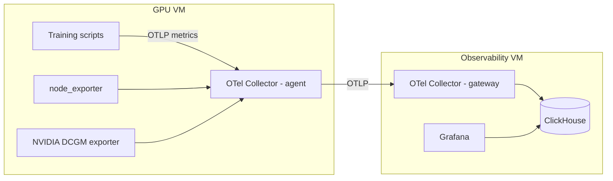

# Observability Stack

This stack provides a separate Observability VM that collects metrics from your GPU VM,
stores them in ClickHouse, and visualizes them in Grafana. The GPU VM stays clean —
only lightweight exporters and an OTel agent run there. The heavy lifting (storage,
dashboards) happens on the Obs VM.

## Components

- **`terraform/`** - Infrastructure provisioning (Yandex Cloud VMs, networking)
- **`ansible/`** - Configuration management and service deployment
- **`config/`** - Docker Compose and service configurations
- **`dashboards/`** - Grafana dashboard definitions (JSON format)
- **`sql/`** - ClickHouse SQL scripts and schema management
- **`Makefile`** - Convenient management commands for all operations



## Why Terraform + Ansible

- **Terraform:** declarative infrastructure provisioning (VMs, networks, security groups) in Yandex Cloud
- **Ansible:** post-provisioning configuration management (installing Docker, deploying Compose stack, provisioning Grafana/ClickHouse)
- This split makes the system reproducible, auditable, and flexible (infrastructure vs software lifecycle separation)

### Cloud portability

Although the current Terraform configuration targets **Yandex Cloud** by default, the stack is designed
to be provider-agnostic. You can adapt it to AWS, GCP, or other cloud providers by changing the Terraform provider
and adjusting VM provisioning settings as needed. The Ansible roles and Docker Compose setup are cloud-neutral and
will work on any Linux VM, regardless of the cloud environment.

## Quick Start

The easiest way to deploy and manage the observability stack is using the included **Makefile** which provides
convenient commands for all operations.

### Prerequisites

- **Terraform** >= 1.6.0
- **Ansible** >= 2.9
- **Yandex Cloud CLI** (`yc`)
- **SSH key pair**

### Installation on macOS

**Yandex Cloud CLI:**

```bash
curl -sSL https://storage.yandexcloud.net/yandexcloud-yc/install.sh | bash
exec -l $SHELL
yc init  # Configure your credentials
```

**Terraform:**

```bash
brew install terraform
```

**Ansible:**

```bash
brew install ansible
```

Check out the official [Yandex Cloud documentation](https://yandex.cloud/en/docs/cli/quickstart#initialize) for more details.

## Deployment Guide

### 1. Initial Setup

```bash
cd ~/Downloads
curl -LO https://releases.hashicorp.com/terraform/1.13.3/terraform_1.13.3_darwin_arm64.zip

ls -lh terraform_1.13.3_darwin_arm64.zip
unzip terraform_1.13.3_darwin_arm64.zip

mkdir -p ~/bin
mv terraform ~/bin/
echo 'export PATH="$HOME/bin:$PATH"' >> ~/.zshrc
exec -l $SHELL

terraform -v
```

## Running Terraform commands

```shell
cd terraform
cp terraform.tfvars.example terraform.tfvars
```

Edit terraform.tfvars with your values:

```shell
terraform init
terraform apply
```

When prompted, type `yes` to confirm. Terraform will provision the Observability VM and print
the `obs_public_ip` in the output. You’ll need this IP for the Ansible step.

Keep the `terraform.tfstate` file safe if you plan to manage the stack over time (e.g., in remote storage for teams).

## Installing Ansible on macOS

```shell
brew install ansible
ansible --version
```

## Management Commands

The project includes a comprehensive **Makefile** with commands for all operations:

**Setup & Configuration:**

```bash
make help           # Show all available commands
make copy-examples  # Copy example configuration files
make setup         # Initialize Terraform and install Ansible dependencies
```

**Infrastructure Management:**

```bash
make apply         # Deploy infrastructure
make destroy       # Destroy infrastructure
make plan          # Show planned changes
make validate      # Validate Terraform configuration
```

**Service Management:**

```bash
make deploy        # Deploy services with Ansible
make ping          # Test connectivity to servers
make config        # Run configuration check
```

**Monitoring & Debugging:**

```bash
make status-services  # Check service status
make logs            # View service logs
make ssh            # SSH to obs server
```

**Security:**

```bash
make vault-create   # Create encrypted vault file
make vault-edit     # Edit vault file
make vault-view     # View vault content
make vault-password # Create vault password file for automatic authentication
```

**Note**: Ansible vault operations require a password file at `ansible/group_vars/.vault_pass`.
Use `make vault-password` to create this file securely, or create it manually:

```bash
echo "your_vault_password" > ansible/group_vars/.vault_pass
chmod 600 ansible/group_vars/.vault_pass
```

Alternatively, you can use `--ask-vault-pass` flag with ansible commands if you prefer manual password entry.

**Complete Workflows:**

```bash
make deploy-all     # Deploy infrastructure and configure services
make teardown       # Stop services and destroy infrastructure
```

## Verification and Access

After successful deployment, verify that all services are running:

```bash
# Check service status
make status-services

# View service logs
make logs

# Test connectivity
make ping

# SSH to server for direct access
make ssh
```

**Access the services:**

- **Grafana**: `http://<obs_public_ip>:3000` (admin/admin)
- **ClickHouse**: `http://<obs_public_ip>:8123`
- **OpenTelemetry**:
  - gRPC: `<obs_public_ip>:4317`
  - HTTP: `<obs_public_ip>:4318`

**For GPU stack deployment:**

```bash
# Get network configuration needed for GPU stack
terraform output obs_network_id obs_subnet_id

# Use these values in gpu/terraform/terraform.tfvars
```

## Cleanup

To avoid unnecessary costs, you can stop services and destroy infrastructure:

```bash
# Stop services and destroy all resources
make teardown

# Or step by step:
make clean-remote  # Stop services only
make destroy       # Destroy infrastructure
```

### Alternative: Manual VM management

```bash
# Stop VM (keeps disks and IPs, still incurs costs)
yc compute instance stop --name obs-vm

# Start VM later
yc compute instance start --name obs-vm
```

## Troubleshooting

### Deployment Reliability

The `make deploy` command includes reliability features to prevent common failures:

**Automatic Health Checks:**

- ClickHouse is started first and health-checked before other services
- Built-in retry logic with 24 attempts (2 minutes total) for ClickHouse to become healthy
- Automatic validation of all services after deployment

**Error Handling:**

```bash
make deploy            # Reliable deployment with health checks
make validate          # Quick validation of all services
make restart-services  # Restart services without full redeploy
```

### Common Issues and Solutions

**SSH Connection Issues:**

```bash
# Host key verification failed
# Solution: SSH keys are automatically managed, but if issues persist:
make ping                      # Test basic connectivity
ssh-keygen -R <obs_public_ip>  # Remove old host key if needed
```

**ClickHouse Startup Issues:**

```bash
# If ClickHouse takes too long to start:
make ssh           # Connect to server
docker compose ps  # Check container status
docker compose logs clickhouse  # View ClickHouse logs
```

**Ansible Vault Issues:**

```bash
# Vault password file issues:
make vault-password  # Recreate vault password file
chmod 600 ansible/group_vars/.vault_pass  # Fix permissions
```

**Service Health Issues:**

```bash
# Validate all services are running correctly:
make validate      # Run health checks
make logs         # View service logs
make status-services  # Check service status
```

**Recovery Commands:**

```bash
# If deployment partially fails:
make restart-services  # Safer than full redeploy
make clean && make setup && make deploy-all  # Full reset

# Check configuration without applying changes:
make config       # Dry-run check
make check-config # Validate all configs
```

**Manual Operations:**

All Makefile commands use standard Terraform and Ansible underneath, so you can always fall back to
manual commands in the respective directories if needed.
